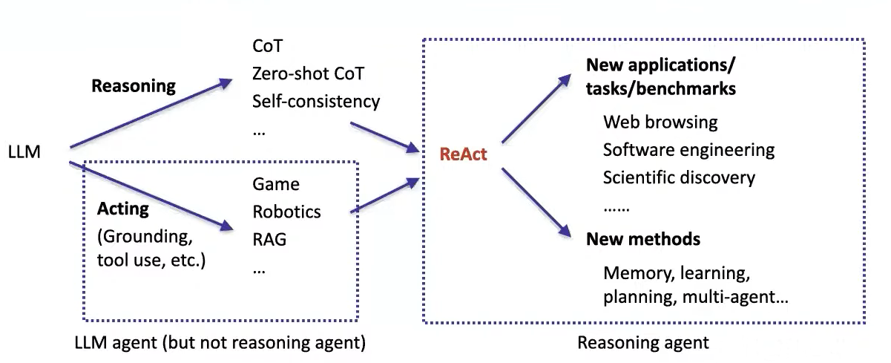
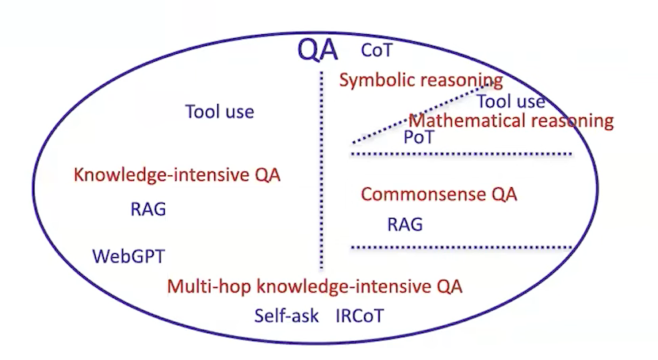
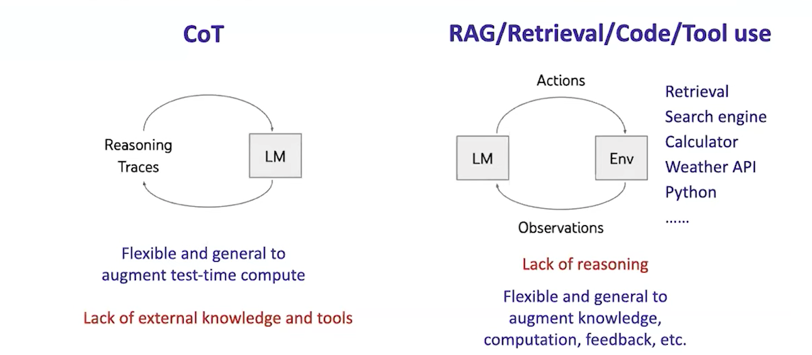

## 3 LLM Agents: Brief History and Overview (Shunyu Yao, OpenAI)

### **Content**

* What is LLM agent?
* A brief history of LLM agents
  * Recent context
  * Ancient context
* Future of LLM agents

### Overview

**LLM agent levels:**

1. Level 1: Text agent
   1. Uses text action and observation
   2. Example: ELIZA, LSTM-DQN
2. Level 2: LLM agent
   1. Uses LLM to act
   2. Examples: SayCan, Language Planner
3. Level 3: Reasoning agent -> The key focus of the field and the talk
   1. Uses LLM to reason to act
   2. Examples: ReAct, AutoGPT

**Tasks**:

1. Question and Answer: ChatGPT

   For simple questions do not require knowledge, reasoning, or computation. 

2. Retrieval-augmented generation (RAG) for knowledge

   [Building Scalable, Explainable, and Adaptive NLP Models with Retrieval - The Stanford AI Lab Blog (2021)](https://ai.stanford.edu/blog/retrieval-based-NLP/)

3. Code augmentation for computation

4. Tool Use: 

   * Search engine, calculator, etc
   * Task-specific models (translation)
   * APIs

5. When both knowledge and reasoning are needed

   * Interleaving retrieval with chain-of-thought reasoning for knowlegde-intensive multi-step questions
   * Measuring and narrowing the Compositionality Gap in language models.

### Reasoning or Acting

To have simple, unifying solution, we need higher level abstraction.

**Comparing CoT and RAG/Code/Tool**

* CoT
  * Flexible and general to augment test-time compute
  * Lack of external knowledge and tools
* RAG/Code/Tool
  * Flexible and general to augment knowledge, computation, feedback, etc
  * Lack of reasoning

**ReAct**

ReAct is a new paradigm of agents that reason and act. It supports 1) one-shot prompting, 2) few-shot prompting, 3) fine-tuning.

* Synergy of reasoning and acting: acting support reasoning, reasoning guides acting.
* Simple and intuitive to use
* General across domains

**Comparing traditional agents and ReAct**

* Traditional Agents: action space $A$ defined by the environment

  * External feedback $o_t$
  * Agent context $c_t = (o_1, a_1, o_2, a_2, ..., o_t)$
  * Agent action $a_t \sim \pi (a|c_t) \in A$

* ReAct: action space $\hat{A} = A \cup \ell$ augmented by reasoning

  * $\hat{a_t} \in \ell$ can be any language sequence
  * Agent context $c_{t+1} = (c_t, \hat{a}_t, a_t, o_{t+1})$
  * $\hat{a}_t \in \ell$ only updates internal context

  Reasoning agent: reasoning is an internal action for agents

### Long-term Memory

Long term memory: 

* Read and write
*  Stores experience, knowledge, skills, ...
* Persist over new experience

Short term memory:

* Append only
* Limited context
* Limited attention
* Do not persist over new tasks

**Reflexion** [Reflexion: Language Agent with Verbal Reinforcement Learning](https://arxiv.org/abs/2303.11366)

Traditional RL:

* Learn via **scalar** reward (sparse signal)
* Learn by updating **weights** (credit assignment)

Reflexion: 'verbal' RL

* Learn via **text** feedback
* Learn by updating **language** (a long-term memory of task knowledge)

**Voyager - A procedural memory of skills** 

[Voyager: An Open-Ended Embodied Agent with Large Language Models](https://arxiv.org/abs/2305.16291)

**Generative Agents - Episodic memory of experience & semantic memory of (reflective) knowledge** [[Generative Agents: Interactive Simulacra of Human Behavior](https://arxiv.org/abs/2304.03442)]

**CoALA**: [Cognitive Architectures for Language Agents](https://arxiv.org/abs/2309.02427)

You can express any agent by three parts 1) memory, 2) action space, and 3) decision making.

### New Application / Tasks / Environment

 History: 

1. **WebShop** (2022)

   [WebShop: Towards Scalable Real-World Web Interaction with Grounded Language Agents](https://arxiv.org/abs/2207.01206)

   1. **Large scale complex environment** based on 1.16M Amazon products
   2. **Automatic reward** based on instruction and product attribute matching
   3. **Challenges** language and visual understanding and decision making

2. **WebArena** (2023)

   [WebArena: A Realistic Web Environment for Building Autonomous Agents](https://arxiv.org/abs/2307.13854)

3. **SWE-Bench** (2023)

   [SWE-bench: Can Language Models Resolve Real-World GitHub Issues?](https://arxiv.org/abs/2310.06770)

4. **ChemCrow**: ReAct enables discovery of a novel chromophore (2023)

   [ChemCrow: Augmenting large-language models with chemistry tools](https://arxiv.org/abs/2304.05376)

### Research Topics

1. Training: 

   [FireAct: Toward Language Agent Fine-tuning](https://arxiv.org/abs/2310.05915)

   People who are training LLM model are not those who are building agents. But those who are building agents are making use of LLM models by prompting. The point is that LLM models are not designed for agent work, instead, they are designed to predict next words. Therefore, this discrepancy of training data results in problems.

   Therefore it's important to establish model-agent synergy:

   * Improve 'agent capabilities' like planning, self-evaluation, calibration
   * Open-source agent backbone model
   * Next trillion tokens for model training

2. Interface:

   [SWE-agent: Agent-Computer Interfaces Enable Automated Software Engineering](https://arxiv.org/abs/2405.15793)

   Human-computer interface (HIC) vs Agent-computer interface (ACI)

   * LLMs and humans are different, so should their interfaces
     * e.g. humans have a smaller short term memory, so have to trade off time for space
   * ACI design can help use
     * Better solve tasks (without changing the agent)
     * Better understand agents (vs humans)

3. Robustness:

4. Human:

   [$t$-bench: A Benchmark for Tool-Agent-User Interaction in Real-World Domains](https://arxiv.org/abs/2406.12045)

5. Benchmark:

###  Language Model Impact

1. Robustness

   Tedious digital labor: interactive form filling, simple debugging, excel operations, simple customer support...

2. Collaboration

   Human interaction jobs: personal assistant, project manager.

3. Exploration

   Creative tasks: survey, hard coding, scientific discover.
