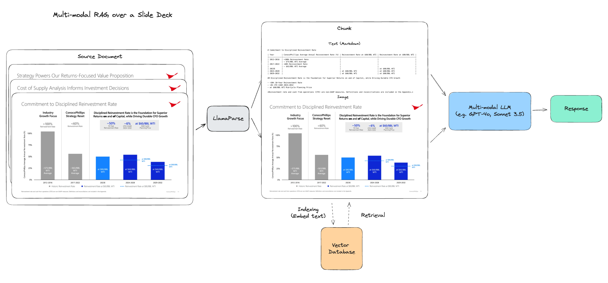

## 4 Agentic AI Frameworks & AutoGen (Chi Wang, AutoGen-AI)

**Content:**

* Agentic AI Frameworks
* AutoGen

**Motivating Questions:**

* What are the future AI applications like?

  [The Shift from Models to Compound AI Systems](https://bair.berkeley.edu/blog/2024/02/18/compound-ai-systems/)

  * Generative AI
  * Agentic AI

  Examples: 

  * Zinley AI: builds a website to browse and extract Hugging Face Models, and download them automatically

* How do we empower every developer to build them?

### Agentic AI

**Key benefits of Agentic AI:**

* Useful interface: natural interaction with human agency
* Strong capability: operate with minimal human intervention
* Useful architecture: intuitive programming paradigm

**Benefits of Agentic Programming:**

* Handle more complex tasks / improve response quality: Improve over natural iteration, divide and conquer, grounding and validation.
* Easy to understand, maintain, extend: modular composition, natural human participation, fast & creative experimentation

**Agentic AI Framework Desiderata:**

* Intuitive unified agentic abstraction
  * Unify models, tools, human for compound AI systems
* Flexible multi-agent orchestration
  * Static / dynamic
  * NL / PL
  * Context sharing / isolation
  * Cooperation / competition
  * Centralized / decentralized
  * Intervention / automation
* Effective implementation of agentic design patterns
  * Conversation
  * Prompting & reasoning
  * Tool use
  * Planning
  * Integrating multiple models, modalities, and memories
* Support diverse application needs

### AutoGen

AutoGen: A programming framework for agentic AI

[AutoGen: Enabling Next-Gen LLM Applications via Multi-Agent Conversation](https://arxiv.org/abs/2308.08155)

* Initially developed in FLAML (Nov 2022)
* Spun off to a standalone repo (Oct 2023)
* Standalone Github organization AutoGen-AI (Aug 2024)

There are two stages:

1. Define agents: conversable and customizable
   * Agent customization 
2. Get them to talk: conversation programming
   * Multi-agent conversations
   * Flexible conversation patterns (sequential chat, nested chat, group chat, hierarchical chat)

Examples:

1. Blog post writing with reflection: two-agent reflection
2. Blog post writing with advanced reflection: nested chat
3. Building a game of a conversational chess: chess board + players
4. Complex task planning and solving with group chat
5. Others: Math problem solving, retrieval-augmented Q&A, decision making in embodied agents, supply-chain optimization, etc. (https://autogen-ai.github.io/autogen/docs/notebooks)

### Applications and Domains

1. [Multi-agent AI enables emergent cognition and real-time knowledge synthesis in science and engineering](https://www.linkedin.com/pulse/multi-agent-ai-enables-emergent-cognition-real-time-science-buehler-tmtce/)
2. [SciAgents: automatic scientific discovery though multi-agent intelligent graph reasoning](https://arxiv.org/abs/2409.05556)
3. [Agent-E: From autonomous Web Navigation to Foundational Design Principles in Agentic Systems](https://arxiv.org/abs/2407.13032)

### Other Research Topics and Directions

1. [AutoBuild Multi-Agent System](https://microsoft.github.io/autogen/0.2/blog/2023/11/26/Agent-AutoBuild/)

2. How to design optimal multi-agent topology?

   Quality; monetary cost; latency, manual efforts

3. How to create highly capable agents?

   Reasoning; planning; modality; learning

4. How to enable scale, safety, and human agency?

   Parallelization; resilience; intent; teaching

## 5 Building an Multimodal Knowledge Assistant (Jerry Liu, LlamaIndex)

**LlamaIndex**: builds production LLM apps over enterprise data; helps any developer build context-augmented LLM apps from prototype to production.

* Open-source: leading developer toolkit for building production LLM apps over data

  Docs: https://docs.llamaindex.ai

  Repo: https://github.com/run-llama/llama_index

* LlamaCloud: A centralized knowledge interface for your production LLM application

  Link: https://cloud.llamaindx.ai

### A better knowledge assistant than basic RAG

1. High-quality multimodal RAG
2. Complex output generation
3. Agentic reasoning over complex inputs
4. Towards a scalable, full-stack application

#### Data

Any LLM App is only as good as your data - "Garbage in, garbage out"

Good data quality is a necessary component of any production LLM app.

Data processing (ETL) involves parsing, chunking, and indexing.

**Case study of complex documents:** 

* Complex documents
  * Embedded tables, charts, images
  * Irregular layouts
  * Headers / footers
* Users want to ask research questions over this data
  * Simple pointed questions
  * Multi-document comparisons
  * Research tasks
* Building a production-ready knowledge assistants over this complex data is challenging

#### An LLM-Native Document Parser

An ideal GenAI-native parser can structure complex document data for any downstream use case.

Requirements: 

* Parse tables accurately into text and semi-structured representations.
* Parse text into semantically coherent chunks.
* Extract visual elements (images /diagrams / charts) into structured formats and return image chunks.
* Automated metadata extraction

Non-requirements:

* Extract detailed JSONs for every element
* Extract bounding boxes

Use cases:

* Multimodal RAG
* Annual reports (tables)
* Excel sheets
* Forms

#### Advanced Parsing + Advanced Indexing

You can combine parsing with hierarchical indexing and retrieval to model heterogeneous unstructured / tabular / multimodal data within a document.

1. Parse documents into elements: text chunks, tables, images, and more
2. For each element, extract one or more text representations that can be indexed
3. Do recursive retrieval

**In a multimodal RAG pipeline**:

* **Indexing**:
  1. Parsing document into text and image chunks with LlamaParse
  2. Link each text chunk to image chunk through metadata
  3. Embed and index text chunks
* **Retrieval**:
  1. Retrieve text chunks by text embeddings
  2. Feed in both text and image to multimodal LLM during synthesis

https://github.com/run-llama/llama_parse/blob/main/examples/multimodal/multimodal_rag_slide_deck.ipynb

#### Automating Decision Making

Agents should have the capability to not only generate chatbot responses but also

1. Produce knowledge work
2. Take actions

*Action-taking and output generation potentially lead to much greater ROI in terms of time savings and capability improvement*

Solution: Structured Outputs and Function Calling

### Agentic Reasoning over Complex Inputs

Naive RAG works well for pointed questions, but fails on more complex tasks.

#### From simple to advanced agents

Agent ingredients and properties:

* Routing, tool use, one-shot query planning, conversation memory: Simple, lower cost, lower latency
* ReAct, dynamic planning + execution: advanced, higher cost, higher latency

#### Agentic RAG

Every data interface is a tool

Use agent reasoning loops (sequential, DAG, tree) to tackle complex tasks

End result: build personalized QA systems capable of handling complex questions

#### Unconstrained vs constrained flows

Constrained flow: 

* Given a task, feed the task to one of the downstream tools based on the decision and router prompt, then feed it to a reflection layer, and then give back a response.  
* A lot of control flows are defined by humans. Programs are like if-else statement and while loops.
* More reliable.
* Less expressive

Unconstrained flows:

* We don't know what the specific plan we want the agent to follow is. We just give the agent a bunch of tools and let it figure t out.
* More expressive - can solve a greater variety of different tasks. 
* Less reliable - it can call tools that you don't want it to call, or get stuck in an infinite loop somewhere.
* More expensive - it uses bigger prompts, you use more tools, marginal token costs are higher

#### Agentic Orchestration Foundations

An agent orchestration framework should have the following properties

* Event-drive: model eac hstep as listening to input events and emitting output events.
* Composable: piece together granular workflows into higher-level workflows.
* Flexible: write logic through LLM calls or through plain python.
* Code-first: express orchestration logic through code. Easy to reach and easy to extend.
* Debuggable and observable: step through and observe states.
* Easily deployable to production: translate notebook code into services that run in production.

#### Multimodal Report Generation

Generate interleaving text-and-image responses with the help of structured outputs

Example architecture: **researcher** and **writer**

1. The researcher retrieves relevant chunks and documents, and puts them into a data cache
2. The writer uses the data cache to generate a structured output of interleaving text and image blocks

https://github.com/run-llama/llama_parse/blob/main/examples/multimodal/multimodal_report_generation.ipynb

https://github.com/run-llama/llama_parse/blob/main/examples/multimodal/multimodal_report_generation_agent.ipynb

### Towards a Scalable, Full-Stack Application

#### Running Agents in Production

You need the right architecture and infra components to serve complex, agentic workflows to end-users as a production application.

Requirements: 

1. Encapsulation and re-use
2. Standardized communication interfaces between agents and with the clients
3. Scalability in number of users and number of agents
4. Human-in-the-loop for the end-user
5. Debugging and observability tools for the developer

#### Llama-deploy

Deploy agentic workflows as microservices:

* Model every agent workflow as a service API
* All agent communication occurs via a central message queue
* Distributed tool-execution
* Human-in-the-loop as a service
* Easy deployment with docker-compose and Kubernetes