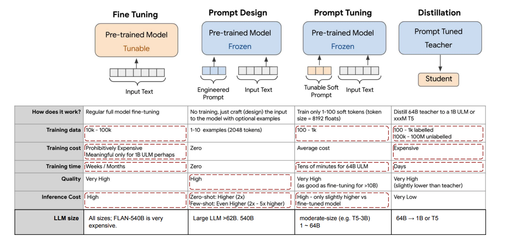

## 6 Enterprise Trend for Generative AI (Burak Gokturk, Google)

### Key Trends in GenAI

Leaderboards:

* [Image Classification on ImageNet](Https://paperswithcode.com/sota/image-classification-on-imagenet)
* [Speech Recognition on LibriSpeech test-other](Https://paperswithcode.com/sota/speech-recognition-on-librispeech-test-other)

Gemini AI Project started in Feb 2023 with many collaborators from Google DeepMind, Google Research, and rest of Google.

The goal is too train highly capable multimodal models and use them all across Google

The initial 1.0 public release in Dec 2023:

* [Introducing Gemini: our largest and most capable AI model](https://blog.google/technology/ai/google-gemini-ai) 
* [Gemini: A Family of Highly Capable Multimodal Models](https://arxiv.org/abs/2312.11805)

Gemini 1.5 released in Feb 2024:

* Information in the context window is clearer: less hallucination and enables in-context learning
* [Gemini 1.5: Unlocking multimodal understanding across millions of tokens of context](https://arxiv.org/abs/2403.05530)

### Enterprise Trends

**a. AI is moving so much faster**

* The amount of data needed has come down
* Anyone can develop AI.

**b. Technical Trends** 

Where we are heading to

* "separate models for different tasks" to "single model that can generalize across millions of tasks".
* "Dense model (the whole model activates)" to "efficient sparse models (the pieces activate as needed)".
* "Single modality models" to "models that deal with many modalities"

**c. It is the choice of the platform that matters**

Key success factors for Gen AI

* Access to a broad set of models

  So you can find the best model for their use case and budget

* Ability to customize models with your data

  So you can improve the quality, latency, and performance of the model

* A platform for managing models in production

  So you can deploy and manage models in a scalable way

* Choice and flexibility at every level

  So you can avoid vendor lock-in and us the best tools for the job

**d. Cost of API calls is approaching 0**

For example, Gemini 1.5 Flash is much cheaper than Gemini 1.5 Pro.

**e. Search**

LLM and Search tend to come together.

Problems of LLM only:

* Trained on historical data (months ago), information not up-to-date
* Hallucination
* Cannot tell you the exact source where the information comes from

**d. Enterprise Search / Assistant**

### Enterprise Learnings with their AI investments

Vertex AI: Google Cloud Generative AI Platform

* Functionalities: Agent builder, Model builder, Model Garden
* Foundation models: Gemini 1.0 Pro, Gemini 1.5 Pro, Chirp 2.0 for speech-to-text, Imagen 2.0, Embeddings API for text and image.

Open model ecosystem - Claude 3 on Vertex AI  

## 7 Key Components of Building Successful Agents/Applications

1. Tuning / distillation
   * Customize based on specific data and use case
   * Create a smaller model for cost / latency purposes
2. Grounding
   * Combine with search to make it factual
3. Extensions / function calling
   * Function calling to be able to make LLMs on areas where they perform poorly

### Fine Tuning

#### **Popular model adaptation approaches and research goals**

#### **Conventional Fine-tuning**

Basic steps: 

* Get a pretrained model checkpoint (e.g. BERT)
* Have a new dataset / task
* Do supervised learning on new dataset and update the weights of the new model

Requires:

* Modest amount of compute (e.g. xxx chips for a few days for a 340B model)
* In-depth knowledge of the model architecture

#### **Conventional Prompt Tuning**

[The Power of Scale for Parameter-Efficient Prompt Tuning](https://arxiv.org/abs/2104.08691)

Basic steps:

* Freeze the backbone model
* Prepend a soft prompt (e.g. learnable) to the input
* Only optimize the prompt to adapt to downstream tasks

#### **Parameter efficient fine tuning** - Pros and Cons

[Parameter-Efficient Fine-Tuning (PEFT) of LLMs: A Practical Guide](https://markovate.com/blog/parameter-efficient-fine-tuning-peft-of-llms-a-practical-guide/)

#### LoRA

[Understanding LoRA — Low Rank Adaptation For Finetuning Large Models](https://towardsdatascience.com/understanding-lora-low-rank-adaptation-for-finetuning-large-models-936bce1a07c6)

Key idea is LoRA is decomposing updated parameters into a product of lower rank matrices.

**Details of LoRA**:

* Pre-trained model weights: $W_0 \in \mathbb{R}^{d \times k}$
* Wights with LoRA tuning: $W_0 + \Delta W = W_0 + BA$
* Trainable parameters: $B \in \mathbb{R}^{d \times r}, A\in \mathbb{R}^{r\times k}$
* Rank of trainable parameters: $\text{rank } r \ll \min (d,k)$
* Original forward pass: $h = W_0 x$
* Modified forward pass: $h = W_0 x + \Delta Wx = W_0 x + BAx$

This can apply to any dense layers in the foundation models. But applying to all dense layers may not be the optimal. Only applying adaptation on attention weights (not on MLPs).

### Distillation

#### Memory and Compute Efficient LLM

* Quantization: speedup 6B LLM inference by 2x
* Retrieval enhancement: model size reduction by 50x in text generation
* Side tuning: avoid back-prop the backbone model
* Distillation: model size reduction and performance improvement

#### Key Terms

* Teacher model
  * The original (large model) that we want to extract the knowledge from it 
* Student model
  * The new model with smaller size 
* Soft labels
  * The output of teacher model when the Temperature is larger than 1 (T>1) 
* Soft predictions
  * The output of student model when the Temperature is larger than 1 (T>1)
* Hard predictions
  * When regular softmax (T=1) is used in the student model
* Hard labels
  * Ground truth label in one-hot encoding

### Grounding

Shortcomings of LLMs when it comes to factuality 

* LLMs are trained in the past
* LLMs halluciate
* LLMs can't cite sources

Minimizing hallucinations boils down to solving 3 problems

* Right context - RAG
* Better models - GPT-4o reduces 81% hallucination
* User experience - cite the sources

### Function Calling

How does function calling work?

1. Define your functions
2. Wrap functions in a tool
3. Call Gemini with a tools argument

A day in the life of a function call:

Function calling is all about developer control and flexibility. From simple tasks to complex workflows: 

1. Structured outputs
2. Real-time information retrieval
3. Employee search tool
4. Customer support agent
5. Autonomous workflow