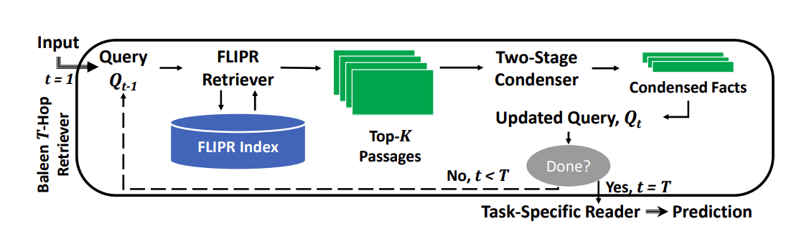
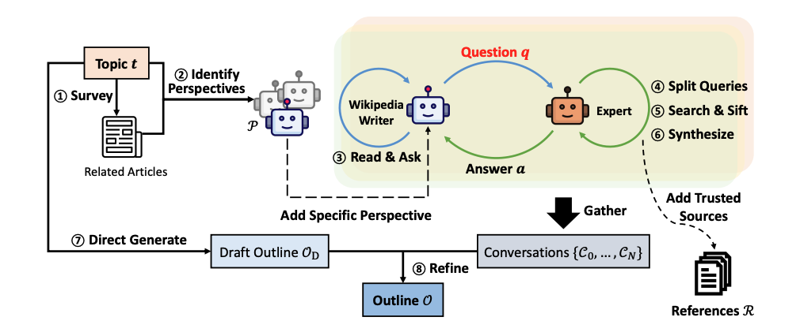

## 8 Compound AI Systems & the DSPy Framework (Omar Khattab, Databricks)

The monolithic nature of LMs makes them hard to control, debug, and improve. To tackle this, AI researchers increasingly build **compound AI systems**. i.e. modular programs in which that LMs are not serving user-facing end-to-end system, but they are actually playing specialized modular roles inside this bigger architecture.

### Compound AI system - i.e. modular programs that use LMs as specialized modular components. 

#### Examples: 

* Example: Retrieval-Augmented Generation (RAG). 
  * Transparency: can debug traces and offer user-facing attribution. 
  * Efficiency: can use smaller LMs, offloading, knowledge & control flow.

* Example: multi-Hop Retrieval-Augmented Generation (e.g Baleen)

  [Baleen: Robust Multi-Hop Reasoning at Scale via Condensed Retrieval](https://arxiv.org/abs/2101.00436)

  

  * Control: can iteratively improve the system & ground it via tools

* Example: compositional report generation (i.e. brainstorming an outline, collecting reference, etc)

  [Assisting in Writing Wikipedia-like Articles From Scratch with Large Language Models](https://arxiv.org/abs/2402.14207)

  

  * Quality: more reliable composition of better-scoped LM capabilities

* Example: task agnostic prompting strategies, e.g. best-of-N, chain of thought, program of thought, ReAct, Reflection, Archon, ...

  * Inference-time Scaling: Facilitates a systematic search for better outputs by exploring different solution paths

#### Summary - advantages of compound AI system: 

* **Quality:** Enables more reliable composition of fine-grained LLM capabilities.
* **Control:** Allows developers to iteratively refine the system and ground it with external tools.
* **Transparency:** Offers the ability to debug execution traces and provide users with clear explanations.
* **Efficiency:** Permits the use of smaller, more efficient LLMs by offloading knowledge and control flow to other modules.
* **Inference-time Scaling:** Facilitates a systematic search for better outputs by exploring different solution paths

#### Problems: 

1. LMs are highly sensitive to how they are instructed to solve tasks.

   **Prompt complexity**: Each prompt couples five very different roles. This intertwined nature complicates the development process.

   1. The core input -> output behavior, a Signiture
   2. The computation specializing an inference-time strategy to the signature, a Predictor
   3. The computation formatting the signature's inputs and parses its typed outputs, an Adapter
   4. The computations defining objectives and constraints on behavior, Metrics and Assertions
   5. The strings that instruct (or weights that adapt) the LM  for desired behavior, an Optimizer

2. **Stringly-typed**: Existing systems couple the system architecture with specific LLM instructions, leading to a lack of portability across different LLMs, objectives, and pipelines

### Natural Language Programming with DSPy

DSPy (Declaratively Self-Improving Python) is a framework that aims to solve these challenges by abstracting compound AI systems as programs with "fuzzy" natural-language-typed modules

[DSPy: Compiling Declarative Language Model Calls into Self-Improving Pipelines](https://arxiv.org/abs/2310.03714)

#### Advantages: 

* **Declarative Programming:** Developers can express the desired system behavior concisely without delving into low-level prompt engineering details.
* **Portability:** DSPy programs can be easily adapted to different LLMs and objectives thanks to the separation of concerns between signatures, predictors, adapters, and optimizers.
* **Iterative Development:** DSPy facilitates a modular and iterative development process where developers can easily add, modify, and optimize individual modules without disrupting the entire system.

#### Optimizing DSPy Programs:

DSPy provides various optimizers that automatically tune the prompts and weights within a program. While they differ in their specific approaches, most optimizers follow a general pattern:

* **Initial Prompt Construction:** Adapters translate module signatures into basic prompts.
* **Example Generation:** Rejection sampling is employed to collect successful execution traces by running the program with the initial prompts and evaluating them against a given metric.
* **Module Update:** The collected examples are used to improve the program modules through:
  * **Automatic few-shot prompting:** Adding successful examples as demonstrations to the prompt.
  * **Instruction induction:** Using a language model to generate improved instructions based on the collected examples.
  * **Multi-stage fine-tuning:** Fine-tuning the LLM weights based on the collected examples

#### Advanced Optimization Techniques:

* **Extending OPRO (Optimization through Prompting):** Adapting existing prompt optimization techniques to multi-stage language model programs.
* **MIPRO (Multi-prompt Instruction PRoposal Optimizer):** Jointly optimizing instructions and few-shot examples using a Bayesian surrogate model for efficient credit assignment

#### Practical Success of DSPy:

* **MEDIQA Competition:** Researchers from the University of Toronto won the MEDIQA competition using DSPy to build a question-answering system for medical domains.

* **Suicide Detection Task:** Researchers from the University of Maryland achieved significant performance improvements by applying DSPy to a suicide detection task.

* **Wide Adoption in Industry and Open Source:** DSPy is being used in various production systems and open-source projects across different industries
