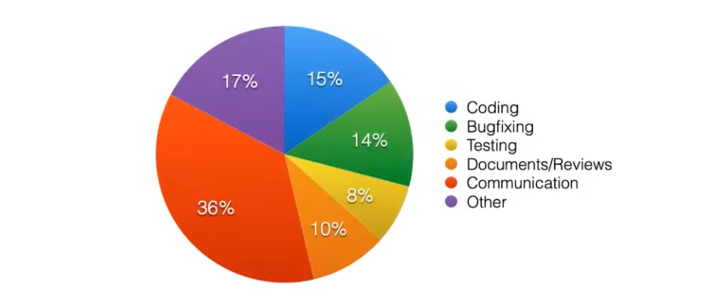

## 9 **Agents for Software Development** (Graham Neubig, CMU)

### Introduction

- **Software is becoming increasingly important** in many industries.

- **However, software development is a complex process** involving various tasks beyond coding, such as bug fixing, testing, documentation, and communication.

  

### How to Support Developers

- **Development Copilots:**  These tools work alongside developers to simplify the coding process. Examples include GitHub Copilot and Cursor.

- **Development Agents**:

  These tools support broader development activities. They can be divided into two categories:

  - **Coding Agents:** These agents focus specifically on coding tasks, like SWE-Agent and Aider.
  - **Broader Development Agents:**  These agents handle a wider range of development tasks. Examples include Devin and OpenHands.

- **Autonomous Issue Resolution** shows promise due to code generation's ability to significantly boost productivity.

### Challenges in Building Coding Agents

- **Defining the Environment:** Determining the appropriate scope and context for the agent to operate within.
- **Designing Observations/Actions:**  Establishing how the agent perceives its surroundings and what actions it can perform.
- **Code Generation (atomic actions):**  Generating individual lines or blocks of code as basic actions.
- **File Localization (exploration):**  Identifying the relevant files to work with within a project.
- **Planning and Error Recovery:** Creating strategies to achieve goals and handle unexpected situations.
- **Safety:** Ensuring the agent's actions do not cause harm or introduce vulnerabilities.

### Software Development Environments

- Actual Environments:

  These are the real-world systems developers use:

  - Source Repositories: GitHub, GitLab
  - Task Management Software: Jira, Linear
  - Office Software: Google Docs, Microsoft Office
  - Communication Tools: Gmail, Slack
  - Testing Environments

- **Most existing coding environments focus primarily on coding**, while developers engage in a variety of other activities, including browsing the web.

### Coding Environments & Datasets

- **Simple Coding:**  Environments like HumanEval/MBPP focus on using the Python standard library and include docstrings, example inputs/outputs, and tests.

- Broader Domains:
  - **CoNaLa:** This dataset is scraped from Stack Overflow and covers a wide range of libraries.
  
    [Learning to Mine Aligned Code and Natural Language Pairs from Stack Overflow](https://arxiv.org/abs/1805.08949)
  
  - **ODEX:** Builds upon CoNaLa by adding execution-based evaluation.
  
    [Execution-Based Evaluation for Open-Domain Code Generation](https://arxiv.org/abs/2212.10481)
  
- **Data Science Notebooks:**  ARCADE utilizes data science notebooks (like Jupyter) to enable incremental implementation and evaluation of code in context.

  [Natural Language to Code Generation in Interactive Data Science Notebooks](https://arxiv.org/abs/2212.09248)

- **Dataset: SWEBench:**  This dataset uses GitHub issues and codebases to create pull requests, demanding long-context understanding and precise implementation.

  [SWE-bench: Can Language Models Resolve Real-World GitHub Issues?](https://arxiv.org/abs/2310.06770)

### Evaluation Metrics

- **Pass@K:** This metric measures the probability of generating at least one correct solution out of K generated examples. To mitigate the high variance of generating only K examples, N > K examples are generated, including C correct answers, and then the expected value is calculated.

  [Evaluating Large Language Models Trained on Code](https://arxiv.org/abs/2107.03374)

- Lexical/Semantic Overlap:

  These metrics address the limitations of execution-based evaluation, which:

  - Require easily executable code, which is difficult with large libraries and in the absence of unit tests.
  - Overlook stylistic aspects of code.

- Popular metrics include:

  - **BLEU:** Measures the overlap of text n-grams between generated code and human-written code.
  
  - **CodeBLEU:**  Expands on BLEU by incorporating syntax and semantic flow.
  
    [CodeBLEU: a Method for Automatic Evaluation of Code Synthesis](https://arxiv.org/abs/2009.10297)
  
  - **CodeBERTScore:** Uses BERTScore with CodeBERT, a language model trained on a vast amount of code.
  
    [CodeBERTScore: Evaluating Code Generation with Pretrained Models of Code](https://arxiv.org/abs/2302.05527)

### Dataset Leakage

- **Dataset leakage is a significant concern.**
- **ARCADE demonstrates that novel notebooks are more challenging than online notebooks**, indicating potential leakage in existing datasets.
- **LiveCodeBench reveals that certain code language models excel on HumanEval due to leakage.**

### A Novel Dataset and Metric

- **Design2Code:** This dataset focuses on generating code from websites and proposes a corresponding model.

  [Design2Code: Benchmarking Multimodal Code Generation for Automated Front-End Engineering](https://arxiv.org/abs/2403.03163)

- Visual Similarity of Web Site:

  Design2Code evaluates generated code based on two metrics:

  - **High-level visual similarity:**  Compares visual embeddings of the generated website and the target website.
  - **Low-level element similarity:**  Calculates the recall of individual elements.

### Designing Observation/Action Spaces

Coding agents need to:

- Understand repository structure
- Read existing code
- Modify or produce code
- Run code and debug

**Examples of Agents:**

- **CodeAct:** Interacts with the environment through code, executing bash and Jupyter commands, leading to faster resolution and higher success rates than direct tool use.

  [Executable Code Actions Elicit Better LLM Agents](https://arxiv.org/abs/2402.01030)

- **SWE-Agent:**  Employs specialized tools for efficient exploration of repositories and code editing.

  [SWE-agent: Agent-Computer Interfaces Enable Automated Software Engineering](https://arxiv.org/abs/2405.15793)

- **OpenHands:**  Defines an "event stream" for coding, execution, and browsing actions/observations and implements SWE-agent-style actions as "agent skills."

  [OpenHands: An Open Platform for AI Software Developers as Generalist Agents](https://arxiv.org/abs/2407.16741)

### Code-Based LLMs

- **Basic Method: Code-generating LM:**  Instructions and/or input code are provided to a language model, which then generates code.  Most advanced language models are trained on code, with some specializing in code generation.

- **Code Data Example: The Stack 2:**  This code pre-training dataset considers licensing aspects.

- **Method: Code Infilling:** This method specifically trains language models for filling in missing code segments.

  [InCoder: A Generative Model for Code Infilling and Synthesis](https://arxiv.org/abs/2204.05999)

- **Method: Long-context Extension**:

  [A Controlled Study on Long Context Extension and Generalization in LLMs](https://arxiv.org/abs/2409.12181)

  Addresses the limitation of standard positional encoding methods like RoPE, which struggle to generalize beyond training data length, particularly problematic for long code sequences. Techniques include:
  
  - **Position interpolation:**  Scaling the positional encoding factor (θ) by a constant.
  - **Neural tangent kernel:**  Scaling low-frequency components of positional encoding while preserving high-frequency components.

### Information Sources for Coding Agents

- Current code context
- Description of the issue to fix
- Repository context
- Open tabs

**Example: Copilot Prompting Strategy:**  This strategy involves extensive prompt engineering to provide the most relevant context to the language model. It extracts information such as:

- Text before and after the cursor position
- Recently accessed files in the same programming language
- Imported files
- Metadata about the language and file path

### File Localization

- **LLM-based Localization:**  The challenge lies in identifying the correct files to modify based on user intent.

- Solutions:
  - **Offload to the User:**  Rely on experienced users to specify the relevant files through prompting.
  
  - **Prompt the Agent with Search Tools:**  Provide the agent access to repository search tools, such as those available in SWE-agent.
  
  - **A-priori Map the Repo:** Create a structured map of the repository to guide the agent.  Aider repomap generates a tree-structured map, while Agentless performs a hierarchical search for each issue.
  
  - **Retrieval-augmented Code Generation:**  Retrieve similar code snippets and use a retrieval-augmented language model to fill in the gaps. This approach can also leverage code documentation
  
    [Retrieval-Based Neural Code Generation](https://arxiv.org/abs/1808.10025)

### Planning and Error Recovery

- Hard-coded Task Completion Process:

  Some agents, like Agentless, follow a pre-defined sequence of steps:

  - File Localization
  - Function Localization
  - Patch Generation
  - Patch Application

  [Agentless: Demystifying LLM-based Software Engineering Agents](https://arxiv.org/abs/2407.01489)

- **LLM-Generated Plans:** Language models can be used to generate plans, which are then executed by one or more executors, as seen in CodeR.

- **Planning and Revisiting:**  Agents like CoAct can revisit previous actions and correct errors.

- **Fixing Based on Error Messages:** Agents like InterCode can use error messages to identify and fix problems.

### Safety

- **Coding models can pose risks, both accidentally and intentionally.**

- Accidental Risks:
  - Pushing code to the main branch unintentionally
  - Deleting tests to achieve test coverage targets
  
- **Intentional Risks:**  Coding agents could be exploited for malicious purposes, such as hacking.

  [InterCode: Standardizing and Benchmarking Interactive Coding with Execution Feedback](https://arxiv.org/abs/2306.14898)

**Safety Mitigation Strategies:**

- **Sandboxing:** Limiting the agent's execution environment to minimize potential damage. OpenHands uses Docker sandboxes for action execution.
- **Credentialing:** Adhering to the principle of least privilege, granting agents only the necessary permissions. An example is managing GitHub access tokens.
- **Post-hoc Auditing:**  Analyzing the agent's actions after execution to detect potential issues. OpenHands employs a security analyzer action for this purpose.

### Conclusion

- **Copilots are already proving valuable, and coding agents are advancing rapidly.**

- **Current Challenges:**  Key challenges include improving code language models, code editing capabilities, file localization, planning, and safety.

- Future Directions:

  Promising research avenues include:

  - Agentic training methods
  - Human-in-the-loop approaches
  - Expanding agent capabilities beyond coding to encompass a broader range of software development tasks

