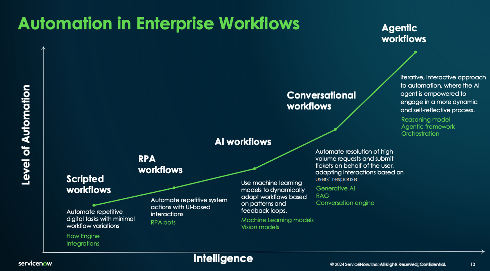

## 10 **AI Agents for Enterprise Workflows** (Nicolas Chapados, Alexandre Drouin, ServiceNow)

### Content

* Background 
  * Defining agents
  * Enterprise workflow concepts
* API Agents
  * Architecture
  * TapeAgents
* Web Agents
  * Web Agent Concepts
  * WorkArena
  * BrowserGym and AgentLab
* Agents in the Workplace
  * Automating enterprise workflow
  * Agents and the future of work
* Resources to Dig Further

### LLM-Based Agents

#### Definition

- LLM agents are LLM-powered entities capable of autonomously planning and executing actions over multiple iterations to achieve goals.

#### Types of Agents

- **Reinforcement Learning Agents**
  - Require extensive training in controlled environments.
  - Limited action space and low generalizability to new tasks.
  - Example: A Minecraft agent cannot send emails.
- **LLM-Based Agents: Zero-Shot Task Solvers**
  - Exhibit common sense due to vast world knowledge acquired during training.
  - General-purpose LLMs are likely trained on documentation of various software.

#### Two Categories of LLM Agents

- **API Agents**
  - Observations: API call results, search history, user-uploaded images, chat history.
  - Actions: API calls, search calls, user responses.
  - Pros: Low latency and risk.
  - Cons: Require appropriate APIs.
- **Web Agents**
  - Observations: What a human user would see on a webpage, including the accessibility tree and raw DOM.
  - Actions: Entering text in fields, clicking elements.
  - Pros: Can perform any action possible on a webpage.
  - Cons: Higher latency and risk.

### Enterprise Workflow Concepts

#### Current State of Enterprise Workflows

- Manual processes persist even with the advent of generative AI.
- Human agents often perform tasks requiring knowledge base lookup, incident similarity checks, access control verification, and resolution note generation.

#### Types of Automation in Enterprise Workflows

- **Scripted workflows**: Automate repetitive digital tasks with minimal variation.
- **RPA workflows**: Automate repetitive system actions through UI interactions.
- **Conversational workflows**: Use machine learning models to dynamically adapt workflows based on patterns and feedback.
- **Agentic workflows**: Automate the resolution of high-volume requests and ticket submissions, adapting based on user responses.
- **AI workflows**: Leverage a flow engine, integrations, RPA bots, ML models, vision models, generative AI, RAG, a conversation engine, a reasoning model, an agentic framework, and orchestration to achieve automation.

#### Agents Addressing Low-Value/Low-Volume Tasks

- Existing Automation Tools:
  - Robotic Process Automation (RPA)
  - Low-Code/No-Code platforms
- Agents can automate tasks such as:
  - Scheduling tweets
  - Sorting email
  - Updating CRM
  - Filling out timesheets
  - Arranging meetings

### API Agents

#### Typical Architecture

- **LLM Agent**: Performs planning, reflection, self-critique, chain of thoughts, and subgoal decomposition.
- **Tools**: Include CodeInterpreter, WebSearch, TriggerWorkflow, Calculator, and potentially new tools.
- **Memory**: Comprises short-term and long-term memory.
- **Action**: Actions taken by the agent on the environment.
- **Environment**: The external system or platform the agent interacts with.

#### TapeAgents

[TapeAgents: a Holistic Framework for Agent Development and Optimization](https://www.servicenow.com/research/TapeAgentsFramework.pdf)

- A holistic framework for agent development and optimization.

- Features:
  - Resumable sessions
  - Low-code components
  - Fine-grained control
  - Concurrency
  - Streaming
- **Key concept**: A structured, granular, semantic-level log called the "tape."
- How it works:
  - Agents read the tape, reason, and write thoughts and actions to it.
  - The environment executes actions from the tape and writes observations to it.
  - Applications utilize the tape for session states.
  - Development tools use tapes for auditing.
  - Algorithms use tapes for tuning agent prompts.
  - Agents generate fine-tuning data from tapes.

#### Case Study: Cost-Effective Form-Filling Assistant

- Task: Develop a conversational assistant that directs users to the appropriate form and assists in filling it.
- Constraints: Ensure a 5-star conversational experience at a low computational cost.
- 3 training domain: FlyCorp, BigBankCorp, CoffeeCorp
- 3 testing domains: DriveCorp, LuxuryCorp, ShopCorp
- Metrics: GREADTH
  - Grounded, Responsive, Accurate, Disciplined, Transparent, Helpful

- Method:
  - Generate synthetic tapes using 19 user agents and a 5-node LLAMA-405B teacher agent.
  - Fine-tune a 1-node LLAMA-8B student agent.
- Outcome: The student agent achieved performance comparable to GPT-4 at a 300x lower cost.

### Web Agents

#### Definition

- Web agents act on the web on behalf of human users, understanding natural language, possessing situational awareness, planning long-term, and executing detailed actions.

#### Building a Basic Web Agent

- Execute actions using Python and Playwright.
- Prompt an LLM with:
  - Task description
  - Web page content as text
  - Action space
- LLM provides actions in response, for example: `fill('14', 'Enola') click('15')`

#### Evaluating Web Agents

- **Realistic Trace-Based Benchmarks**
  - WebLINX, Mind2Web
  - Advantages: Use real websites.
  - Disadvantages: Rely on "gold traces" for evaluation, potentially memorizing traces.
- **Realistic Live Environment Benchmarks**
  - Open Web Environments (e.g., AssistantBench)
  - Sandboxed Environments (e.g., WorkArena, BrowserGym)
  - Advantages: More realistic, support any website, consider latency, avoid trace memorization, evaluate end results.
  - Disadvantages: Can be unreliable due to network issues for open web environments, limited to open-source software and require complex local setup for sandboxed environments.

#### WorkArena

- An open-source benchmark comprising ~600 work-related tasks built on the ServiceNow platform.
- Tasks encompass basic UI interactions and complex, realistic workflows.
- Accessible and free to use.

#### WorkArena++

[WorkArena++: Towards Compositional Planning and Reasoning-based Common Knowledge Work Tasks](https://arxiv.org/abs/2407.05291)

- Extends WorkArena with more realistic enterprise workflows.
- Tasks include:
  - Solving decision-making problems (workload balancing, scheduling, task assignment).
  - Reading dashboards and taking action.
  - Searching for information in lists, forms, and knowledge bases.
  - Budget and expense management.
  - Multi-step tasks requiring information gathering and problem-solving.
  - Detecting infeasible tasks.

**Benchmark Explosion**: The rapid emergence of multiple benchmarks creates a need for unification and a standardized evaluation platform.

#### Challenges in Web Agent Development

- **Long Context Understanding**: Real-world web pages can contain hundreds of thousands of tokens, making context management crucial.
- **Long-Term Planning**: Web agents often need to plan and execute complex sequences of actions.
- **Learning and Adaptability**: Web agents need to learn from demonstrations and adapt to dynamic environments.
- **Multimodality**: Humans rely heavily on visual information when browsing the web, which current web agents often underutilize.
- **Cost and Efficiency**: To be viable, web agents need to produce more value than their operational cost.
- **Safety and Alignment**: Web agents need to be safe and operate within ethical boundaries, especially given the unpredictable nature of the World Wide Web.

### Agents in the Workplace

#### Impact of AI Agents on Work

- **AI agents are poised to revolutionize the nature of work.**
- Example: AI agents can automate tasks in access control scenarios by gathering information, generating plans, and interacting with systems.
- AI agent development and maintenance costs need to be considered for effective deployment.

#### Understanding Knowledge Work

- Knowledge work encompasses a vast array of tasks, including data analysis, communication, content creation, management, technical support, research, and many other intellectually demanding activities.
- Web Agents to address Low Value / Low Volume tasks

#### Studying the Future of Knowledge Work with WorkArena

- WorkArena provides a platform to study and understand the potential impact of AI agents on various knowledge work tasks.

#### O*NET: Cataloging the Workforce

[O*NET](https://www.onetonline.org/)

- O*NET is a comprehensive resource for occupational information that can be used to analyze tasks and jobs, helping understand the potential impact of AI agents on the workforce.

#### Gen AI Adoption

[The economic potential of generative AI: The next productivity frontier - McKinsey](https://www.mckinsey.com/capabilities/mckinsey-digital/our-insights/the-economic-potential-of-generative-ai-the-next-productivity-frontier)

* Anticipated adoption curve and worst case adoption curve of Gen AI where AI agent is a subset across the economy.
* Adoption drivers:
  * Technological maturity
  * Integration speed
  * Relative cost of technology vs labor
  * Technology diffusion rate
  * Supply constraints (e.g. GPUs, regulatory)

#### Assessing Impact: Top-Down vs. Bottom-Up

- **Top-down assessment**: Analyzes tasks within jobs from O*NET, predicting the impact of AI and determining if human involvement remains necessary. It offers broad coverage but lacks detailed insights.
- **Bottom-up assessment**: Maps O*NET tasks to benchmark tasks in platforms like WorkArena, tracking AI performance to estimate job automation potential. It provides a detailed picture but may have limited coverage.

#### Envisioning AI Augmentation

[Navigating the Jagged Technological Frontier: Field Experimental Evidence of the Effects of AI on Knowledge Worker Productivity and Quality - HBS, BCG](https://www.hbs.edu/ris/Publication%20Files/24-013_d9b45b68-9e74-42d6-a1c6-c72fb70c7282.pdf)

There is human interaction research there to figure out what will be the most productive pattern for each person. Maybe it depends on personality types, and the kind of work to be done, etc. 

- **Centaur Model - strategic separation**: Separates tasks into "human tasks" and "AI tasks," where AI supports human intuition by mapping problem domains, gathering information, performing data analysis, and refining human-generated content.
- **Cyborg Model - task-level collaboration**: Involves task-level collaboration, where humans leverage AI capabilities like persona adoption, task learning from examples, logical explanations, deep dives, and responses to contradictions.
